# OHSU Hands-on Data Jamboree: Code Your Graph
Alison Presmanes Hill & Julianne Myers  

<style>
body {
    font-family: "Cabin", sans-serif;
}
p {
    font-family: "Cabin", sans-serif;
}
</style>

<a href="mailto:hillali@ohsu.edu"><i class="fa fa-envelope fa-fw"></i>&nbsp; hillali@ohsu.edu</a><br>
<a href="#"><i class="fa fa-map-marker fa-fw"></i>&nbsp; OHSU Gaines Hall 19</a>
 
# Overview


This workshop was presented at OHSU on June 24, 2016. The same dataset and plots were made for a parallel breakout session using Python; materials are all here:
https://github.com/abalter/data-viz-jamboree


## Based on the Article
Review:
[Graphics and statistics for cardiology: comparing categorical and continuous variables](http://heart.bmj.com/content/early/2016/01/27/heartjnl-2015-308104.full) 
[Full text](http://faculty.washington.edu/kenrice/heartgraphs/effectivegraphs.pdf)
Authors: Kenneth Rice, Thomas Lumley  
doi:10.1136/heartjnl-2015-308104  
   
### Additional materials
http://faculty.washington.edu/kenrice/heartgraphs/
    
### Data from
NHANES (National Health and Nutrition Examination Survey)
http://www.cdc.gov/nchs/nhanes/

Dataset url: http://faculty.washington.edu/kenrice/heartgraphs/


# Setup

## Install packages 

Do this once per machine.


```r
install.packages("readr")
install.packages("ggplot2")
install.packages("ggbeeswarm") 
install.packages("dplyr")
install.packages("MASS")
install.packages("hexbin")
install.packages("ggalt")
```

## Load packages 

Do this once per R session.


```r
library(readr)
library(ggplot2)
library(ggbeeswarm)
library(dplyr)
library(MASS)
library(hexbin)
library(ggalt)
```

## Import data 

- Use `readr` package to import our csv with `read_csv` function
- The first argument in the `read_csv()` parentheses is the url to the dataset
- The second argument, `na = "."`, specifies that missing data in this dataset is denoted by a period
- Finally, assign the data to an R object using `<-` and call that object something simple like `heart`


```r
heart <- read_csv("http://faculty.washington.edu/kenrice/heartgraphs/nhaneslarge.csv", na = ".") #na= tells R that . is an na value
```


# Basics

Use the `head()` function in your console and check with your partner to see if you got the same output 


```r
head(heart)
```


Let's look at the variables in our `heart` dataframe:


```r
names(heart)
```

```
 [1] "BPXSAR"    "BPXDAR"    "BPXDI1"    "BPXDI2"    "race_ethc"
 [6] "gender"    "DR1TFOLA"  "RIAGENDR"  "BMXBMI"    "RIDAGEYR" 
```

These are pretty cryptic variable names. For example, you may be wondering what `DR1TFOLA` and `BPXSAR` are. The [data dictionary online](http://faculty.washington.edu/kenrice/heartgraphs/) helps us demystify the variables we are interested in:

* `BPXSAR`: systolic blood pressure (mmHg)
* `BPXDAR`: diastolic blood pressure (mmHg)
* `BPXDI1`, `BPXDI2`: two diastolic blood pressure readings
* `race_ethc`: race/ethnicity, coded as Hispanic, White non-Hispanic, Black non-Hispanic and Other
* `gender`: sex, coded as Male/Female
* `DR1TFOLA`: folate intake (μg/day)
* `RIAGENDR`: sex, coded as 1/2
* `BMXBMI`: body mass index (kg/m2)
* `RIDAGEY`: age (years)


Let's start with folate intake. 


```r
ggplot(heart, aes(x = DR1TFOLA)) 
```

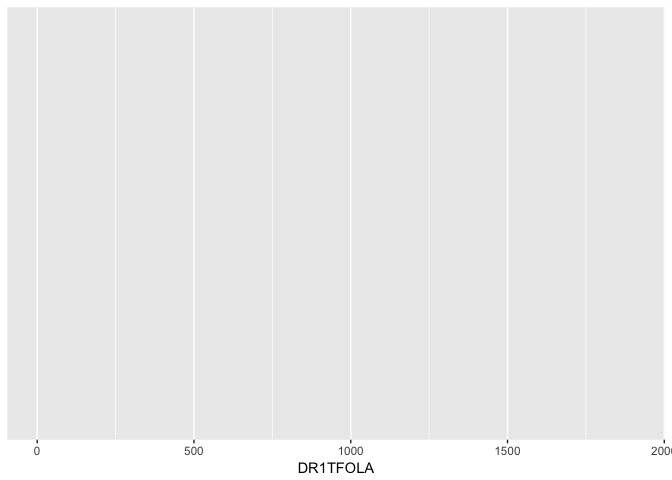<!-- -->

The code above should produce an empty plot with `DR1TFOLA` on the x-axis. The first argument in the `ggplot()` function is your dataframe- we called ours `heart`. Then we set 1 aesthestic: the x-axis, and mapped it only our folate intake variable.

`ggplot` makes a plot by layering. So let's take this empty plot and add a visible layer to it- called a geometric object or `geom` for short. Let's start with the `geom_histogram`. You can always find out what arguments go along with a specific geom using the help function in the console:


```r
?geom_histogram
```

# Graphs for display of single samples

Let's focus first on univariate plots by examining folate intake (a continuous variable).

## Histograms

Create a histogram by adding a `geom_histogram()` layer and using the `+` sign


```r
ggplot(heart, aes(x = DR1TFOLA)) +
  geom_histogram()
```

<!-- -->

*Small tweak #1:* change x-axis title 


```r
ggplot(heart, aes(x = DR1TFOLA)) +
  geom_histogram() +
  labs(x = "folate intake (μg/day)")
```

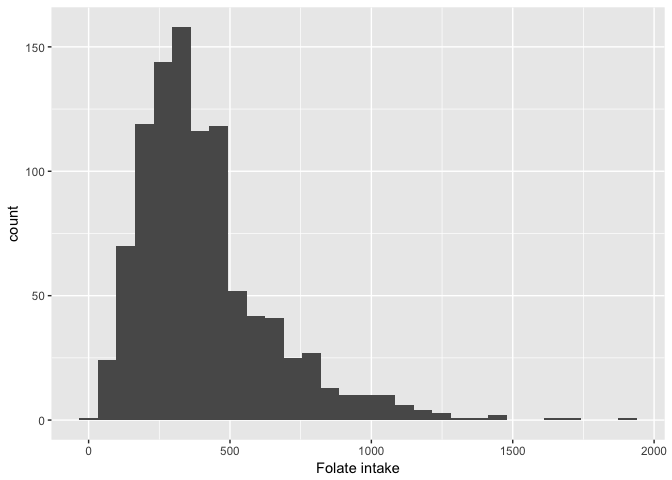<!-- -->


*Small tweak #2:* change outline of bars


```r
ggplot(heart, aes(x = DR1TFOLA)) +
  geom_histogram(colour = "white") +
  labs(x = "folate intake (μg/day)")
```

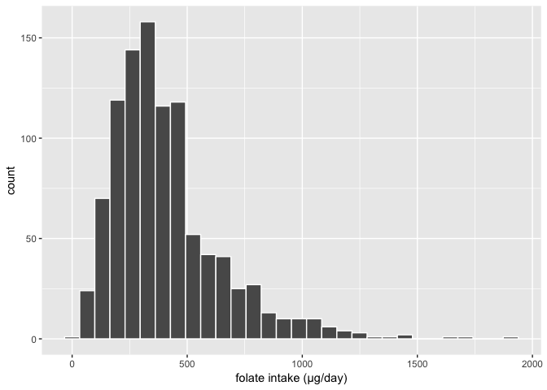<!-- -->

*Small tweak #3:* change fill of bars


```r
ggplot(heart, aes(x = DR1TFOLA)) +
  geom_histogram(colour = "white", fill = "peachpuff") +
  labs(x = "folate intake (μg/day)")
```

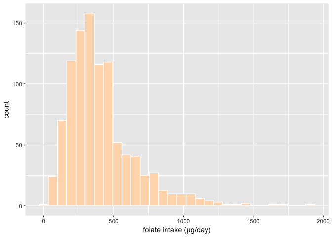<!-- -->

*Small tweak #4:* change number of bins

All of our histograms have given us this warning:

`#stat_bin() using bins = 30. Pick better value with binwidth.`

This warning tells us that this is a default that ggplot chose for us given the data it has. For now, we will **change the amount of bins to 50**. Feel free to play around with this. You can change this to any number.  


```r
ggplot(heart, aes(x = DR1TFOLA)) +
  geom_histogram(colour = "white", fill = "peachpuff", bins = 50) +
  labs(x = "folate intake (μg/day)")
```

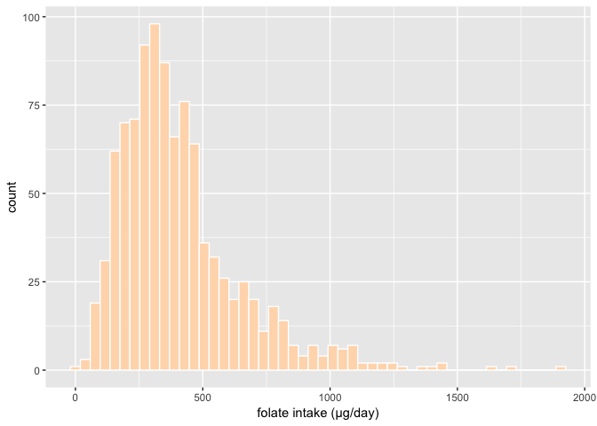<!-- -->


# Graphs comparing two variables: continuous vs. categorical

OK, let's add another variable to the mix. We'll keep looking at folate intake as the continuous variable, with `gender` as the categorical variable. There are a few ways to do this in `ggplot2`. 

* Facets
* Colors
* Side-by-side plots (along the x-axis)


## Facets

About facets (from `facet_wrap` documentation):

> "Most displays are roughly rectangular, so if you have a categorical variable with many levels, it doesn't make sense to try and display them all in one row (or one column). To solve this dilemma, facet_wrap wraps a 1d sequence of panels into 2d, making best use of screen real estate."

Let's add `+ facet_wrap(~variable)` to split the histograms based on `gender`


```r
ggplot(heart, aes(x = DR1TFOLA)) +
  geom_histogram(colour = "white", fill = "peachpuff", bins = 50) +
  labs(x = "folate intake (μg/day)") +
  facet_wrap(~gender)
```

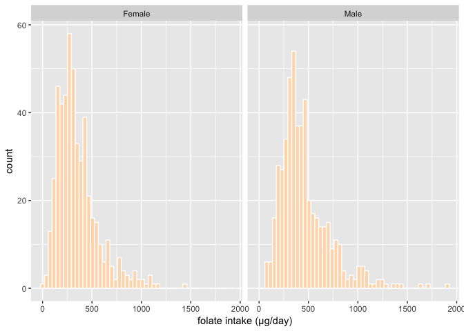<!-- -->


Let's say you want the exact same plot, but want to see if density gives a different picture than a histogram. To do this, we pick a different `geom`. The code is similar, but for `geom_density`, make sure to take out the bin specification as a density plot doesn't have visible bins.

About density estimation (from `geom_density` documentation):

> "Kernel density estimation (KDE) is a non-parametric way to estimate the probability density function of a random variable. Kernel density estimation is a fundamental data smoothing problem where inferences about the population are made, based on a finite data sample."

Use the kernel density geom (`geom_density`) instead of `geom_histogram`


```r
ggplot(heart, aes(x = DR1TFOLA)) +
  geom_density(colour = "white", fill = "peachpuff") +
  labs(x = "folate intake (μg/day)") +
  facet_wrap(~gender)
```

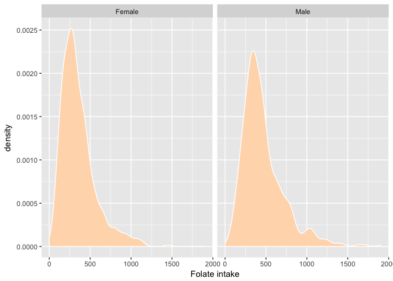<!-- -->

## Colours

So far, when we played with colours, we set fill/colour without mapping them onto another variable (i.e., `(colour = "white", fill = "peachpuff")`). Now, we want fill/colour to **vary** based on the value of a specific variable. Here we want colour to depend on `gender`, so we map the colour aesthetic (`aes(colour = variable)`) onto the variable `gender`.

Notice moving the colour into aesthetics parentheses.


```r
ggplot(heart, aes(x = DR1TFOLA)) +
  geom_density(aes(colour = gender)) +
  labs(x = "folate intake (μg/day)") 
```

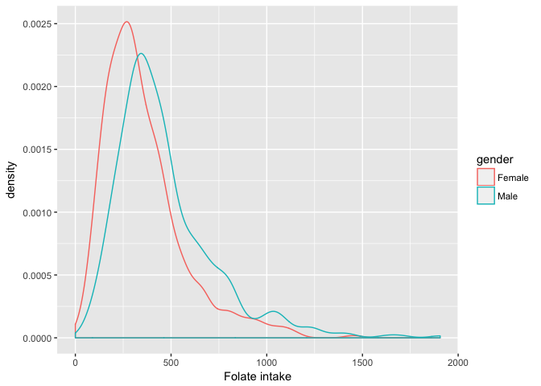<!-- -->

This is the exact same! Play around with changing global aesthetics (like below) versus geom-specific aesthetics (like above). It won't matter when you only have one layer, but once you start adding `geoms` and `stats`, this can be a powerful way to change your visualization.


```r
ggplot(heart, aes(x = DR1TFOLA, colour = gender)) +
  geom_density() +
  labs(x = "folate intake (μg/day)") 
```

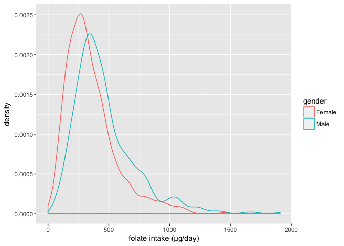<!-- -->

## Side-by-side plots

Now let's make some side-by-side univariate plots, specifically dotcharts or stripcharts, to visualize systolic blood pressure by gender.


```r
ggplot(heart, aes(x = gender, y = BPXSAR)) +
  geom_point() +
  labs(x = "", y = "Systolic BP (mmHg)")
```

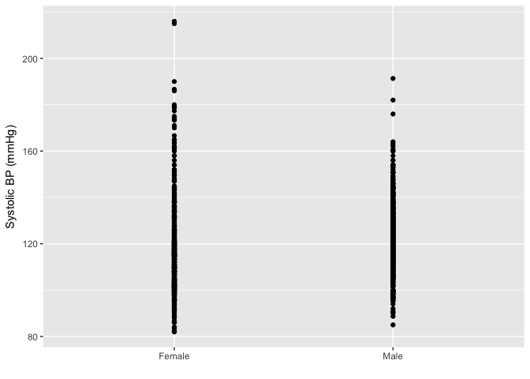<!-- -->

Too many points! 

*Small tweak #2:* Add alpha in the geom layer to make points more transparent. 

Alpha works on a scale from 0 (transparent) to 1 (opaque).
 

```r
ggplot(heart, aes(x = gender, y = BPXSAR)) +
  geom_point(alpha = .3) +
  labs(x = "", y = "Systolic BP (mmHg)")
```

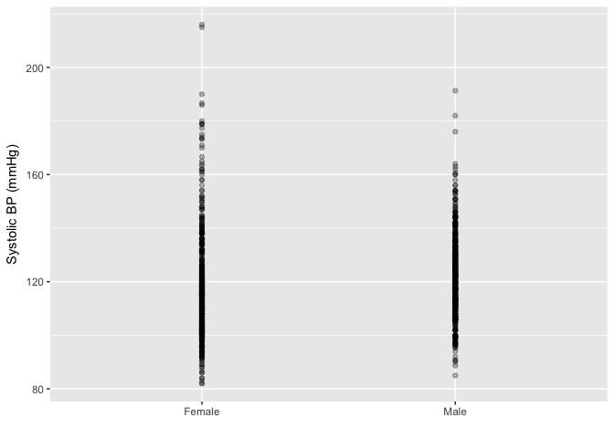<!-- -->

*Small tweak #3*: try jittering the points

To do this, instead of `geom_point`, we will switch to using `geom_jitter`, which automatically adds both vertical and horizontal space (noise) to your datapoints.


```r
ggplot(heart, aes(x = gender, y = BPXSAR)) +
  geom_jitter(alpha = .3) +
  labs(x = "", y = "Systolic BP (mmHg)")
```

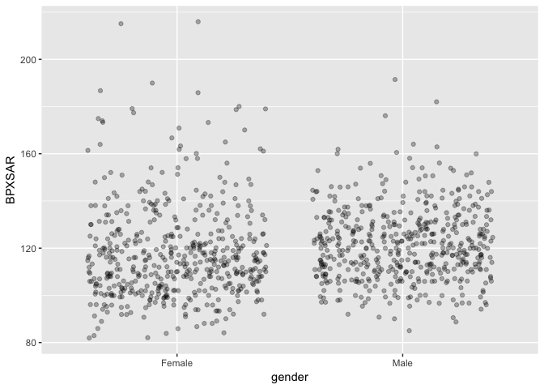<!-- -->

*Small tweak #4*: control the jitter

Sometimes you may only want to change the width of jitter but not the height. 


```r
ggplot(heart, aes(x = gender, y = BPXSAR)) +
  geom_jitter(alpha = .3, width = .2, height = 0) +
  labs(x = "", y = "Systolic BP (mmHg)")
```

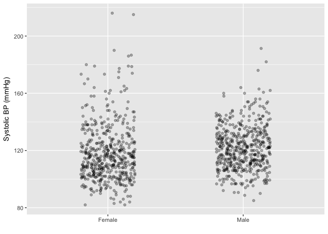<!-- -->


Now let's try a different geom in our side-by-side plot, which is available through the `beeswarm` package you should have already loaded.


```r
ggplot(heart, aes(x = gender, y = BPXSAR)) +
  geom_beeswarm() +
  labs(x = "", y = "Systolic BP (mmHg)")
```

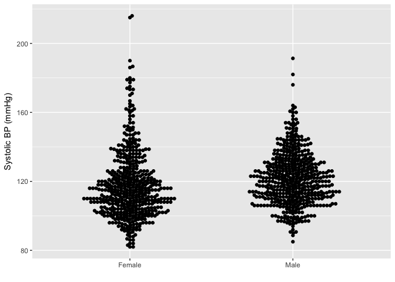<!-- -->

*Small tweak #1:* add alpha again


```r
ggplot(heart, aes(x = gender, y = BPXSAR)) +
  geom_beeswarm(alpha = .2)  +
  labs(x = "", y = "Systolic BP (mmHg)")
```

<!-- -->

*Small tweak #2:* add statistics

We'll include the mean plus 95% CI


```r
ggplot(heart, aes(x = gender, y = BPXSAR)) +
  geom_beeswarm(alpha = .2) +
  stat_summary(fun.y = "mean", geom = "point", colour = "orange") +
  stat_summary(fun.data = mean_cl_boot, geom = "linerange", colour = "orange")  +
  labs(x = "", y = "Systolic BP (mmHg)")
```

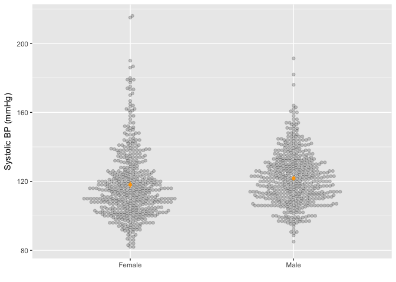<!-- -->

*Small tweak #3:* add another geom layer

Try adding `geom_boxplot` on top of your side-by-side beeswarm plot. Also try re-ordering the geoms to see what changes.


```r
ggplot(heart, aes(x = gender, y = BPXSAR)) +
  geom_boxplot(outlier.shape = NA) +
  geom_beeswarm(alpha = .2) +
  labs(x = "", y = "Systolic BP (mmHg)")
```

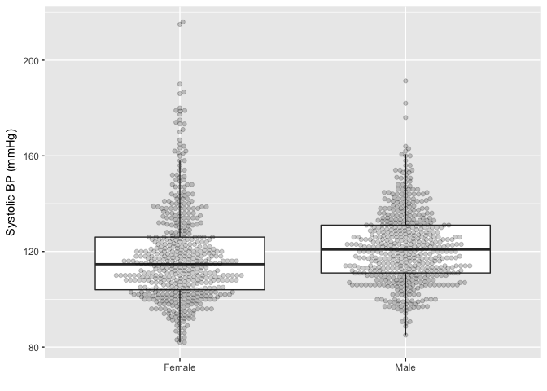<!-- -->


New geom time- this time use `geom_violin`.


```r
ggplot(heart, aes(x = gender, y = BPXSAR)) +
  geom_violin(alpha = .2) +
  labs(x = "", y = "Systolic BP (mmHg)")
```

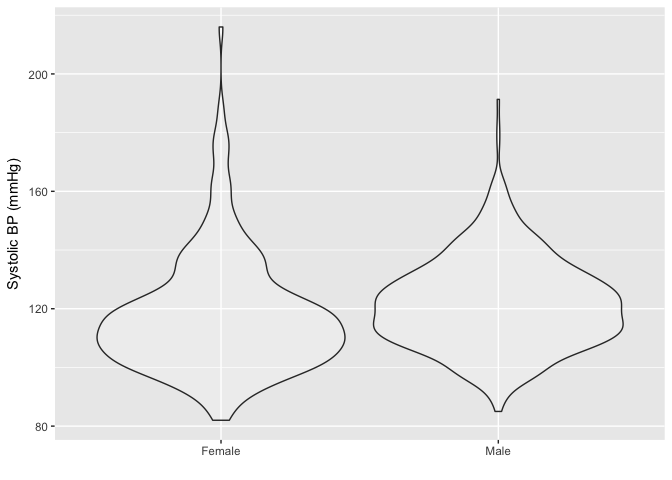<!-- -->

*Small tweak #1:* add statistics

Let's include the sample mean and median


```r
ggplot(heart, aes(x = gender, y = BPXSAR)) +
  geom_violin(alpha = .2) +
  stat_summary(fun.y = "mean", geom = "point", colour = "orange") +
  stat_summary(fun.y = "median", geom = "point", colour = "blue") +
  labs(x = "", y = "Systolic BP (mmHg)")
```

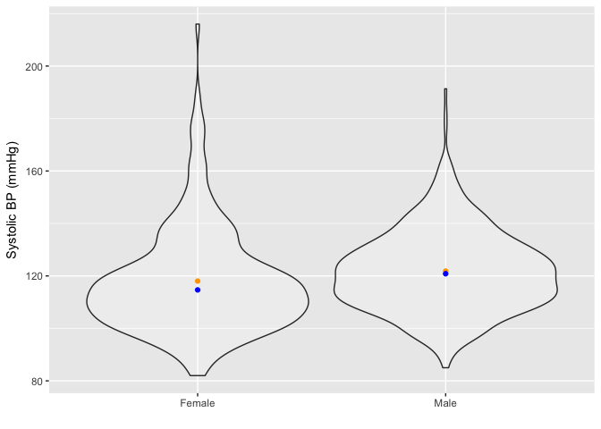<!-- -->

*Small tweak #2:* add another geom layer

Add another layer to your violin plot: try `geom_boxplot`


```r
ggplot(heart, aes(x = gender, y = BPXSAR)) +
  geom_violin(alpha = .2) +
  geom_boxplot(width = .05) +
  labs(x = "", y = "Systolic BP (mmHg)")
```

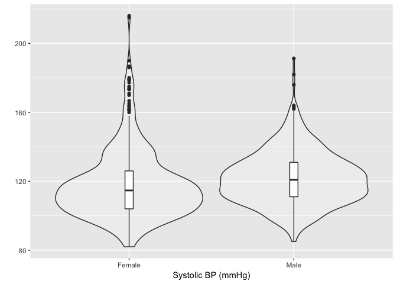<!-- -->

# Graphs comparing two variables: continuous vs. continuous

Now we'll create some bivariate plots to look at the association between age and systolic blood pressure, both of which are continuous variables.

## Scatterplots


```r
ggplot(heart, aes(x = RIDAGEYR, y = BPXSAR)) +
  geom_point() +
  labs(x = "Age (years)", y = "Systolic BP (mmHg)")
```

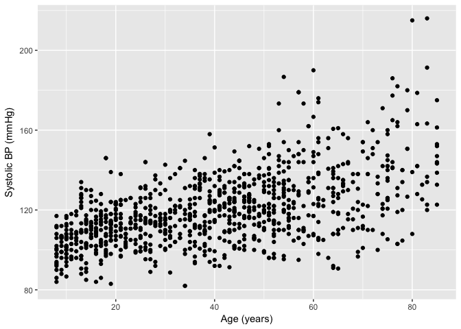<!-- -->

If you have big n, try hexbin plot

```r
ggplot(heart, aes(x = RIDAGEYR, y = BPXSAR)) +
  geom_hex() +
  labs(x = "Age (years)", y = "Systolic BP (mmHg)")
```

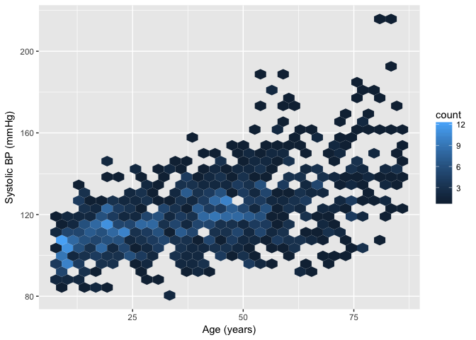<!-- -->

Make colors make more sense

```r
library(viridis)
ggplot(heart, aes(x = RIDAGEYR, y = BPXSAR)) +
  geom_hex() +
  labs(x = "Age (years)", y = "Systolic BP (mmHg)") +
  scale_fill_gradientn(colours = viridis(256, begin = 1, end = 0))
```

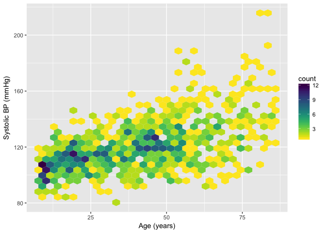<!-- -->


```r
library(ggalt)
ggplot(heart, aes(x = RIDAGEYR, y = BPXSAR)) +
  stat_bkde2d(aes(fill = ..level.., alpha = ..level..), geom = "polygon", bandwidth = c(2,2))  +
  labs(x = "Age (years)", y = "Systolic BP (mmHg)") +
  scale_fill_gradientn(colours = viridis(256, begin = 1, end = 0))
```

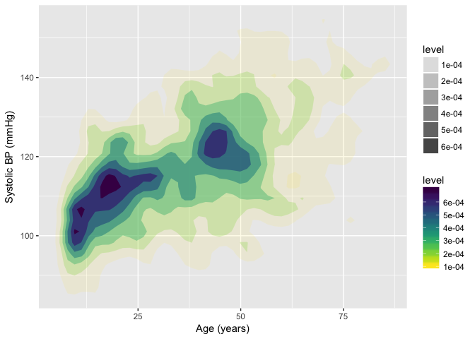<!-- -->

Add linear regression line with SE

```r
ggplot(heart, aes(x = RIDAGEYR, y = BPXSAR)) +
  geom_point() +
  geom_smooth(method = "lm") +
  labs(x = "Age (years)", y = "Systolic BP (mmHg)")
```

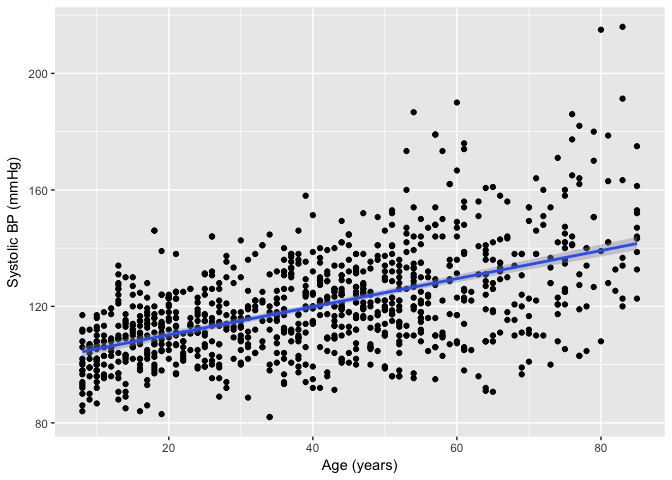<!-- -->

Default is loess line

```r
ggplot(heart, aes(x = RIDAGEYR, y = BPXSAR)) +
  geom_point() +
  geom_smooth() +
  labs(x = "Age (years)", y = "Systolic BP (mmHg)")
```

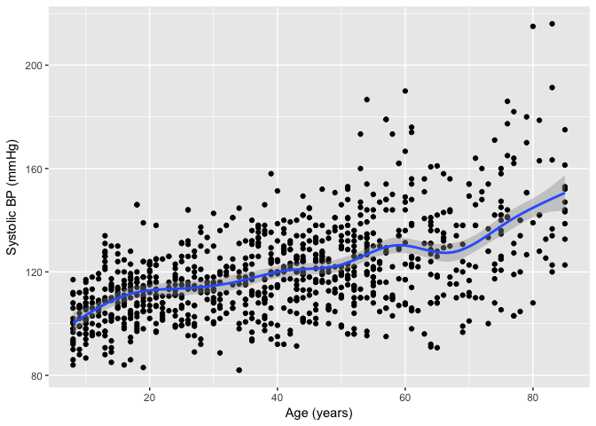<!-- -->

Add splines

```r
library(splines)
library(MASS)
ggplot(heart, aes(x = RIDAGEYR, y = BPXSAR)) +
  geom_point() +
  stat_smooth(method = "lm", formula = y ~ ns(x, 3)) +
  labs(x = "Age (years)", y = "Systolic BP (mmHg)")
```

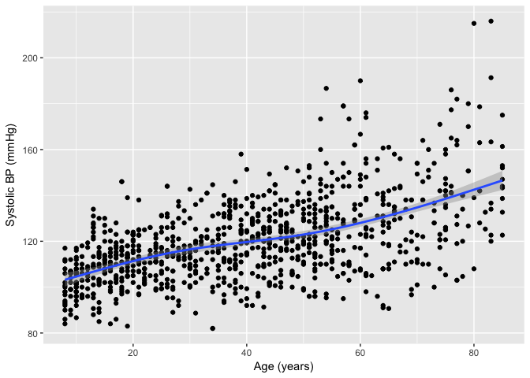<!-- -->

# Graphs illustrating more than two variables

We'll finish up by creating some multivariable plots that help us visualize how the association between body mass index & systolic BP varies by gender and age (so 4 variables!).

Just copy this code to create a categorical age variable:

```r
library(dplyr)
heart2 <- heart %>% 
  mutate(age_cat = cut(RIDAGEYR, c(0, 30, 55, 100)))
```

Recreate theirs first


```r
ggplot(heart2, aes(x = BMXBMI, y = BPXSAR)) +
  geom_point() +
  stat_smooth(aes(colour = gender), method = "lm") +
  facet_wrap(~age_cat) +
  labs(x = "Body Mass Index"~(kg/m^2), y = "Systolic BP (mmHg)")
```

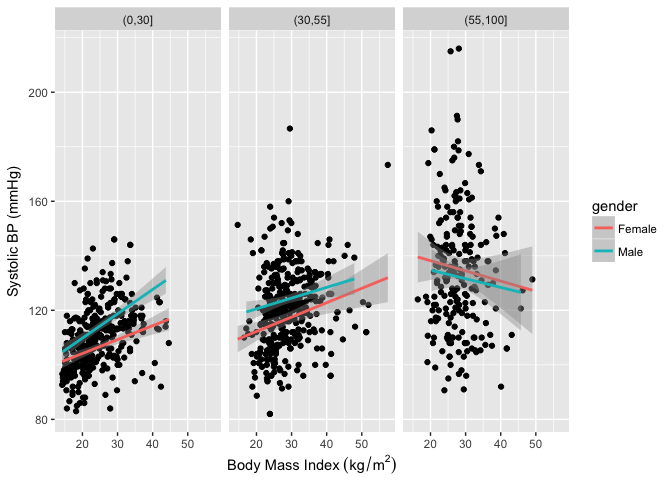<!-- -->

Try with facet grid, update labels


```r
ggplot(heart2, aes(x = BMXBMI, y = BPXSAR)) +
  geom_point() +
  stat_smooth(aes(colour = gender), method = "lm") +
  facet_grid(gender~age_cat) +
  labs(x = "Body Mass Index"~(kg/m^2), y = "Systolic BP (mmHg)")
```

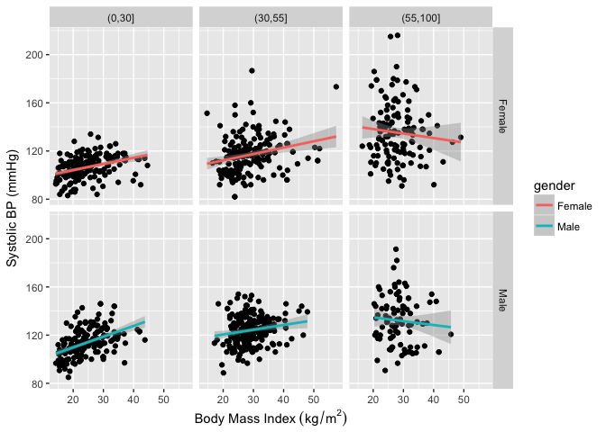<!-- -->

Play with colors!

```r
ggplot(heart2, aes(x = BMXBMI, y = BPXSAR, colour = gender)) +
  geom_point(alpha = .5) +
  stat_smooth(method = "lm") +
  facet_grid(gender~age_cat) +
  theme_minimal() +
  labs(x = "Body Mass Index"~(kg/m^2), y = "Systolic BP (mmHg)") +
  scale_color_manual(values = c("#B47CC7", "#D65F5F"), guide = FALSE)
```

<!-- -->


```r
my_colors <- c("#C4AD66", "#77BEDB")
ggplot(heart2, aes(x = BMXBMI, y = BPXSAR, colour = gender)) +
  geom_point(alpha = .5) +
  stat_smooth(method = "lm") +
  facet_grid(gender~age_cat) +
  theme_light() +
  labs(x = "Body Mass Index"~(kg/m^2), y = "Systolic BP (mmHg)") +
  scale_color_manual(values = my_colors, guide = FALSE)
```

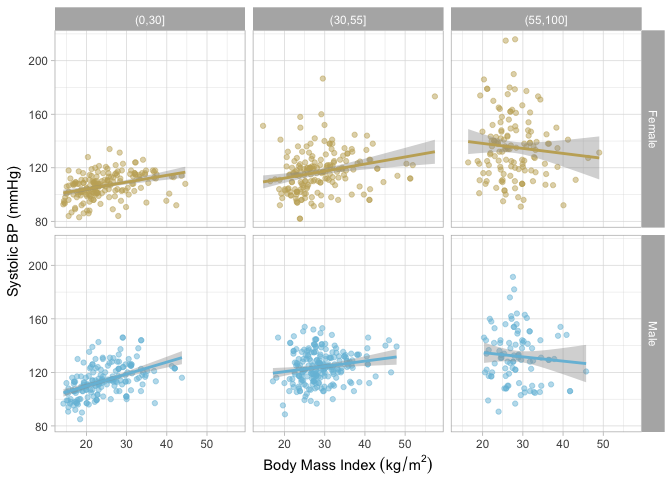<!-- -->


